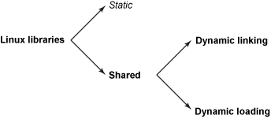
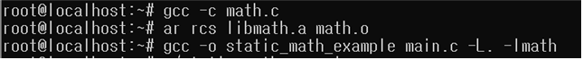

## Make와 Makefile

### make 란?
- 소프트웨어 개발을 위해 유닉스 계열 운영체제에서 사용되는 프로그램 빌드 도구이다.
- 각 파일의 종속 관계를 파악해 Makefile에 기술된 대로 컴파일 명령이나 shell 명령을 순차적으로 수행한다.

### makefile이란 ? 
- 프로그램을 빌드하기 위해 make 문법에 맞춰서 작성하는 문서이다.

### makefile이 필요한 이유 ?
- 오래 걸리고 반복되는 컴파일 작업을 자동화 할 수 있다.
- 수정된 소스파일만 컴파일 할 수 있다. 따라서 재컴파일 시간을 매우 단축시킬 수 있다.

 

](images/makefile_1.png)

 

main.c, math.c 두 개의 파일을 각각 컴파일해서 object 파일을 생성하고  
생성한 Object 파일을 하나로 묶는 링크 과정을 통해 실행 파일인 app.out을 생성한다.   
여기서 math에서 정의된 함수를 main에서 호출하는 의존성이 존재한다.

 

### 실행 결과   
](images/makefile_2.png)

 

## 라이브러리의 정의와 종류

### 라이브러리란 ?
라이브러리란 특정한 코드(함수 혹은 클래스)를 포함하고 있는 컴파일된 파일,   
재사용 할 수 있는 미리 컴파일된 코드 조각 모음이다.    

이러한 라이브러리를 만드는 이유는 자주 사용되는 특정한 기능을 main 함수에서 분리시켜 놓음으로써  
 코드 재사용, 모듈화 및 유지보수, 성능 최적화, 기능 확장에 유리하기 때문이다.

 Liinux는 다음과 같은 두 클래스의 라이브러리를 지원한다.
 1. 정적 라이브러리 => 컴파일 시 정적으로 바인딩된다.
 2. 동적 또는 공유 라이브러리 => 프로그램이 시작될 때 로드되고 메모리에 로드되며 런타임에 바인딩이 발생한다.

동적 또는 공유 라이브러리는 다음과 같이 추가로 분류할 수 있다.
- 동적으로 연결된 라이브러리   
=> 여기에서 프로그램은 공유 라이브러리와 연결되고 커널은 실행 시 라이브러리를 로드한다.(메모리에 없는 경우)

- 동적으로 로드된 라이브러리  
=> 프로그램이 라이브러리와 함꼐 함수를 호출하여 모든 권한을 갖는다.

 

|확장자명|운영체제|라이브러리 구분|
|:---:|:---:|:---:|
|.a|리눅스|정적|
|.so|리눅스|동적|
|.lib|윈도우|정적|
|.dll|윈도우|동적|   

 

---

### 정적 라이브러리(Static library)

#### 특징
- 실행 프로그램에 외부 함수를 같이 포함시키는 것을 정적 링크라고 한다.
- 컴파일 시점에 프로그램에 포함되는 라이브러리이다.   
- 실행 파일과 라이브러리가 결합되어 하나의 독립적인 실행 파일(object file.o)이 생성된다.
- 보통 .a의 확장자를 가진다.
- 기능이 최소로 필요한 작은 프로그램에 유리하다.

#### 장점
- 실행 파일의 크기가 크더라도 이식성이 높고 의존성 문제가 없다.
- 컴파일 후 실행 파일을 다른 시스템으로 복사해도 작동한다.
- 빠른 실행속도를 제공한다.

#### 단점
- 라이브러리 코드의 중복 사용으로 인한 메모리 낭비가 발생할 수 있다.
- 컴파일시 적재되므로 유연성이 떨어진다.
- 라이브러리 업데이트가 필요한 경우, 모든 관련 프로그램을 다시 컴파일 하여야 한다.

#### 실행 예시

 

### 공유 라이브러리(Shared Library)

#### 특징
- 동적 링킹을 할 때 사용하는 라이브러리를 공유 라이브러리라 한다.
- 프로그램 실행을 시작할 때 /lib/ld.so 또는 /lib/li-linux.so 모듈이 이들 공유 라이브러리를 동적으로 링킹시켜준다.
- 대부분 .so 확장자를 가진다.
- 프로그램에 직접 외부 함수를 포함시키지 않고 연결만 해 놓은 후에 실행 시점에 외부 라이브러리에서 로딩하는 방식

#### 장점
- 메모리를 절약하면서 라이브러리 코드의 중복 사용을 허용한다.
- 실행 파일의 용량이 작아지고 같은 라이브러리를 쓰는 여러 프로그램이 있을 경우 라이브러리가 바뀌면 프로그램을 재컴파일 하지 않아도 된다.

#### 단점
- 공유 라이브러리를 잘못 사용하면 DLL Hell이라 불리우는 관리 문제가 발생할 수 있다.
- app을 외부에 배포할 때도 라이브러리를 포함해야 한다.

#### 실행 예시

 

### 동적 라이브러리(DLL : Dynamic Link Library)

#### 특징
- 정적 또는 동적 링킹이 실행 이전 또는 시작 시에 이루어지는 것과는 달리, 실행 도중에 동적으로 로딩되는 라이브러리이다.

#### 장점
- 작은 크기의 실행 파일을 생성하며, 라이브러리 업데이트가 용이하다.
- 여러 프로그램 간의 라이브러리 공유로 메모리 절약이 가능하다.
- 웹 응용에서 플러그인 모듈들이 이에 해당하며, 필요한 라이브러리를 수시로 등록, 실행, 제거 시키므로 매우 유연하게 사용가능 하다.

#### 단점
- 실행 시점에 라이브러리를 로드하기 때문에 실행 속도가 느릴 수 있다.
- 의존성 문제가 발생할 수 있으며, 필요한 라이브러리를 찾지 못할 경우 오류가 발생한다.

#### 실행 예시

