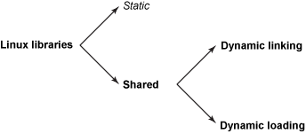

## Make와 Makefile

### make 란?
- 소프트웨어 개발을 위해 유닉스 계열 운영체제에서 사용되는 프로그램 빌드 도구이다.
- 각 파일의 종속 관계를 파악해 Makefile에 기술된 대로 컴파일 명령이나 shell 명령을 순차적으로 수행한다.

### makefile이란 ? 
- 프로그램을 빌드하기 위해 make 문법에 맞춰서 작성하는 문서이다.

### makefile이 필요한 이유 ?
- 오래 걸리고 반복되는 컴파일 작업을 자동화 할 수 있다.
- 수정된 소스파일만 컴파일 할 수 있다. 따라서 재컴파일 시간을 매우 단축시킬 수 있다.

 

](images/makefile_1.png)

 

main.c, math.c 두 개의 파일을 각각 컴파일해서 object 파일을 생성하고  
생성한 Object 파일을 하나로 묶는 링크 과정을 통해 실행 파일인 app.out을 생성한다.   
여기서 math에서 정의된 함수를 main에서 호출하는 의존성이 존재한다.

 

### 실행 결과   
](images/makefile_2.png)

